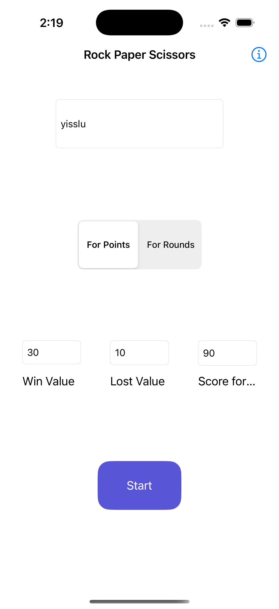
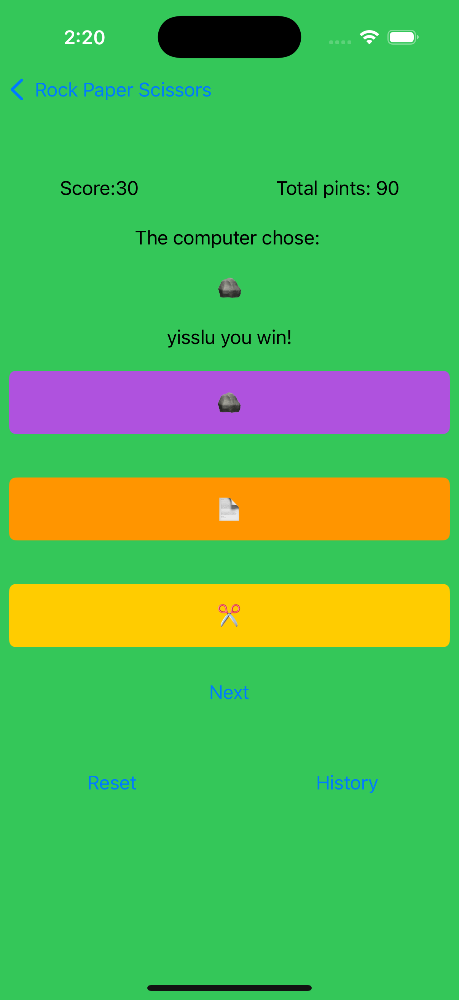
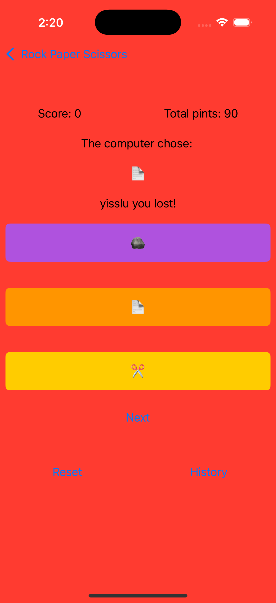
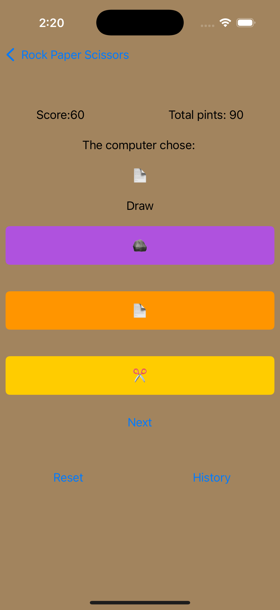

# RockPaperScissors 🎮✊📄✂️

RockPaperScissors is a fun and interactive mobile app that brings the classic game of Rock, Paper, Scissors to your fingertips. Play against the computer, customize your name, and choose your preferred game mode!

## Features

- 🧑‍💻 **Player Customization**: Enter your name before starting the game.
- 📖 **How to Play**: A helpful screen shows the basic rules of Rock, Paper, Scissors.
- 🎯 **Game Modes**:
  - **By Rounds**: Decide a number of rounds to play.
  - **By Score**: Set a target score to win.
- 🤖 **Play Against the Computer**: Every time you make a move, the computer picks randomly.
- 🌈 **Dynamic Feedback**: The background color changes and a message is shown to let you know if you won, lost, or tied the round.

## 📱 UI Preview
Here’s a quick look at the app in action:

### 🛠️ Config game section
<p align="center">
  
</p>

### 🎮 Game in action
<p align="center">
  
  
  
</p>

---

## 🛠️ Technologies

- **Swift**
- **UIKit** (Programmatics, StoryBoards and XIB UI)

---


## Installation

1. Clone the repository:
   ```bash
   git clone https://github.com/yisslu/RockPaperScissorsGame.git
2. Open in XCode:
   ```bash
   open RockPaperScissors.xcodeproj
3. Build and run on a simulator or your iOS device.
